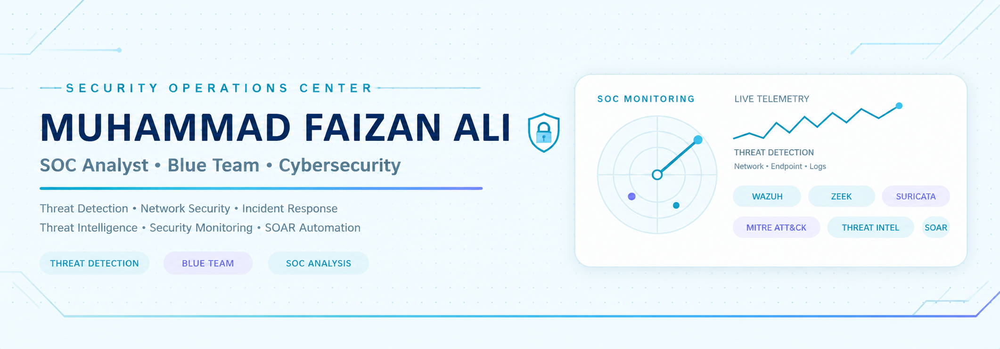

<p align="center">
  
</p>

<p align="center">
🎓 <b>BS Cyber Security Student</b> • 🛡️ <b>Ethical Hacking Enthusiast</b> • 🌐 <b>Network Security Learner</b> • 🔎 <b>Future Security Analyst</b>
</p>


---

# 🧠 About Me

I'm a **BS Cyber Security student at HITEC University Taxila, Pakistan**, with a strong interest in **information security, ethical hacking, network security, threat analysis, and SOC operations**.

I enjoy learning through hands-on labs and building practical security projects that help me understand how systems, networks, and security controls work in real-world environments.

My current focus is developing practical skills in **security monitoring, threat detection, network analysis, digital forensics, vulnerability assessment, and security automation**.

```text
Cyber Security
      │
      ├── Ethical Hacking
      ├── Network Security
      ├── SOC Operations
      ├── Threat Intelligence
      ├── Digital Forensics
      ├── Security Monitoring
      └── Security Automation
```

---

# 🔐 Cybersecurity Focus

### 🛡️ Security Operations

* Security monitoring and alert analysis
* SIEM concepts and SOC workflows
* Wazuh security monitoring
* Security event investigation
* Incident analysis

### 🌐 Network Security

* Network traffic analysis
* Nmap scanning and enumeration
* Wireshark packet analysis
* Zeek Network Security Monitoring
* Suricata IDS/IPS
* Network reconnaissance

### 🔎 Threat Intelligence

* IOC analysis * Malware intelligence * Hash investigation * MITRE ATT&CK mapping * VirusTotal analysis * AlienVault OTX

### ⚙️ Security Automation

* Wazuh alert automation
* n8n workflows
* Webhook-based security integrations
* Python security scripting
* SOAR concepts
* AI-assisted security alert analysis

### 🐧 Linux & Security Labs

* Kali Linux
* Ubuntu
* Linux administration
* VirtualBox / VMware
* Security lab environments
* TryHackMe & Hack The Box

---

# 🚀 Current Learning

I'm continuously developing my skills in:

* 🔐 Ethical Hacking
* 🌐 Network Security
* 🛡️ SOC Operations
* 🔎 Threat Intelligence
* 🧬 Digital Forensics
* 📊 Security Monitoring
* 🤖 Security Automation
* 🧠 MITRE ATT&CK
* 🐍 Python for Cybersecurity
* 🧩 Data Structures & Algorithms
* 🌍 Network Administration

---

# 🧪 Cybersecurity Projects

## 🛡️ Wazuh + n8n AI Security Automation

A security automation project integrating **Wazuh, n8n and AI-based alert processing**.

### Architecture

```text
┌─────────────────┐
│   Wazuh Agent   │
└────────┬────────┘
         │
         ▼
┌─────────────────┐
│  Wazuh Manager  │
└────────┬────────┘
         │
         ▼
┌─────────────────┐
│ Security Alert  │
└────────┬────────┘
         │
         ▼
┌─────────────────┐
│   n8n Webhook   │
└────────┬────────┘
         │
         ▼
┌─────────────────┐
│ AI Processing   │
└────────┬────────┘
         │
         ▼
┌─────────────────┐
│ Decision/Action │
└─────────────────┘
```

### Key Areas

* Wazuh security alerts
* Automated webhook integration
* n8n workflow automation
* AI-assisted alert analysis
* Human-readable security summaries
* Severity and response analysis
* SOAR concepts

**Technologies:** `Wazuh` `n8n` `Python` `Webhooks` `AI` `SOAR`

---

## 🌐 Network Security Monitoring — Zeek & Suricata

Hands-on network monitoring and intrusion detection lab using **Zeek and Suricata**.

### Practiced Areas

* Network traffic monitoring
* Nmap scan analysis
* Zeek `conn.log` analysis
* Suricata IDS alerts
* Custom detection rules
* ICMP monitoring
* Network reconnaissance detection

**Technologies:** `Zeek` `Suricata` `Nmap` `Wireshark` `Linux`

---

## 🔐 SecureHash

**SecureHash** is a security-focused password hashing and verification application designed to demonstrate secure authentication concepts.

### Features

* 🔑 Argon2id password hashing
* 🌶️ Password peppering
* 🔐 TOTP-based 2FA
* 🎲 Secure password generation
* 👤 Authentication system
* 🗄️ SQLite database
* 📋 Security audit logging
* ⚙️ Environment-based configuration

**Technologies:** `Python` `CustomTkinter` `Argon2id` `TOTP` `SQLite`

---

## 📦 Inventory Management System

A web-based inventory management system developed using **PHP, MySQL and Bootstrap 5**.

### Features

* Product management
* Category management
* Supplier management
* Warehouse management
* Stock management
* Order management
* Employee management
* Dashboard
* Database relationships

**Technologies:** `PHP` `MySQL` `Bootstrap 5` `JavaScript` `XAMPP`

---

# 🧰 Security Tools

<p align="center">


</p>

<p align="center">


</p>

<p align="center">


</p>

---

# 💻 Programming & Development

<p align="center">


</p>

### Languages

```text
Python       ████████████████████
C++          ███████████████
Java         █████████████
PHP          ████████████
JavaScript   ███████████
SQL          ███████████
```

---

# 📜 Certifications & Training

* 🛡️ **Ethical Hacking** — Hope Foundation
* 🔐 **Siemens PSCE** — OPSWAT Academy
* 🏭 **ICIP — Introduction to Critical Infrastructure Protection**
* 🌐 **CCNA** — Currently Enrolled

---

# 🎯 Career Goals

My long-term goal is to build strong practical expertise in cybersecurity and work toward a professional career in **Security Operations, Threat Analysis, Ethical Hacking, and Network Security**.

### My Goals

* 🛡️ Build strong SOC and security monitoring skills
* 🔎 Develop practical threat analysis capabilities
* 🌐 Strengthen network security knowledge
* 🧪 Continue hands-on ethical hacking practice
* 🐍 Develop Python-based security automation
* 🤖 Explore AI-assisted cybersecurity workflows
* 🧬 Improve digital forensics skills
* 📚 Continue learning modern cybersecurity technologies
* 🤝 Contribute to cybersecurity and open-source projects

---

# 📊 GitHub Analytics

<p align="center">


</p>

---

# 🔥 GitHub Streak

<p align="center">


</p>

---

# 📈 GitHub Activity

<p align="center">


</p>

---

# 🌐 Connect With Me

<p align="center">

<a href="mailto:muhammadfaizanali102@gmail.com">

</a>

<a href="https://github.com/muhammadfaizanali102">

</a>

</p>

---

# 🧠 Security Mindset

<p align="center">

<b>Learn → Build → Analyze → Secure → Improve</b>

</p>

Cybersecurity is a continuous learning process. I believe that practical experimentation, understanding how systems work, and consistently improving defensive skills are essential for becoming a better security professional.

---

<h3 align="center">

🛡️ Thanks for visiting my profile!

</h3>

<p align="center">

⭐ Explore my repositories • 🔎 Follow my cybersecurity journey • 🚀 Let's build and learn

<p align="center">
  
</p>

<p align="center">
  <b>Cyber Security Student | SOC Analyst | Blue Team | Network Security</b>
</p>
